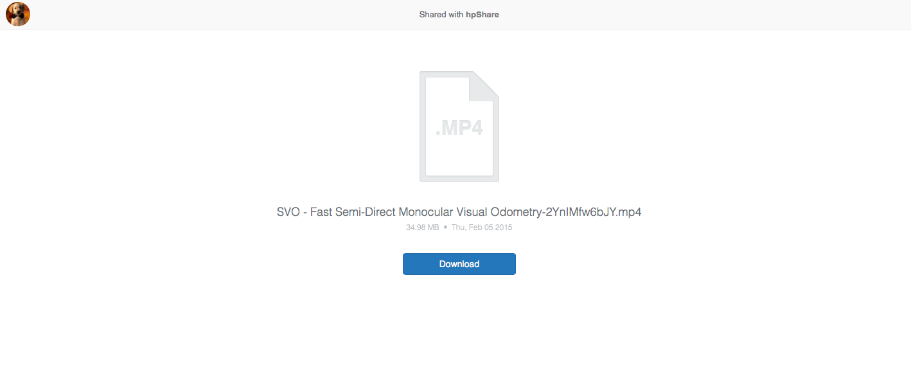

# hpShare

`hpShare` is a **self-hosted** [CloudApp](http://getcloudapp.com)-like, [Droplr](http://droplr.com)-like server especially for **Chinese** users. It uses **[QiNiu](http://qiniu.com)** as storage backend instead of [Amazon S3](http://http://s3.amazonaws.com) which is slow and may be blocked someday in China.

`hpShare` comes with an admin portal (provided by `Django`) and several client apps (CLI, DropZone script, etc.)

`hpShare` is written in [Django](http://http://djangoproject.com).

## Screenshorts & GIFs

## How-To

- Prepare python environment, `pip install -r requirements.txt`
- Get a [QiNui](http://qiniu.com) (free) account
- `mv config.py.sample config.py`, fill it up
- Adjust `hpshare/settings.py` as you need
- Prepare Django project by running `./manage.py syncdb`, `./manage.py collectstatic`
- Run it! `uwsgi --module=hpshare.wsgi:application --master --socket=uwsgi.sock --processes=4 --daemonize=uwsgi.log` Also see `nginx.conf`. 

## Clients

- CLI: see `clients/python/hpShare.py`
- DropZone script: see `clients/hpShare.dzbundle`, double-click it to install (you need to install `DropZone` first)

# TODO

- Mime-Type
- Upload directory (Zip it first) via DropZone
