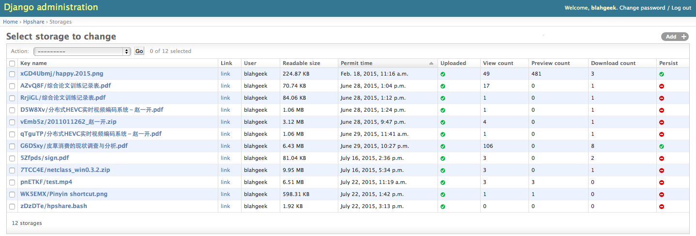

# hpShare

`hpShare` is a **self-hosted** [CloudApp](http://getcloudapp.com)-like, [Droplr](http://droplr.com)-like server especially for **Chinese** users. It uses **[QiNiu](http://qiniu.com)** as storage backend instead of [Amazon S3](http://http://s3.amazonaws.com) which is slow and may be blocked someday in China.

`hpShare` is now also an URL shortener. It's a good start for your personal short domain.

`hpShare` comes with an admin portal (provided by `Django`) and several client apps (CLI, DropZone script, etc.)

`hpShare` is written in [Django](http://http://djangoproject.com).

## Demos & Screenshots & GIFs

[z1k.co/F5j7](http://z1k.co/F5j7)

[z1k.co/F5O8](http://z1k.co/F5O8)

[z1k.co/blog](http://z1k.co/blog)




## How-To

- Get a [QiNiu](http://qiniu.com) (free) account
- `mv config.py.sample config.py`, fill it up
- Finally, run it inside docker:

```
docker run \
    -e DJANGO_SECRET_KEY=some_secret_key_for_django \
    -e ADMIN_USER=root \
    -e ADMIN_EMAIL=root@localhost \
    -e ADMIN_PASSWORD=password \
    -v /path/to/your/config.py:/app/config.py \
    -v /path/to/data_dir:/data \
    -p 8001:80 \
    -it -d blahgeek/hpurl
```

## Clients

- CLI: `wget http://your.domain.com/~cli/hpshare`, alternatively see `clients/bash/hpshare.bash`

## Admin

Goto `http://your.domain.com/`

Run `./manage.py purge_storage` to delete expired files. Add it to a cron job!

